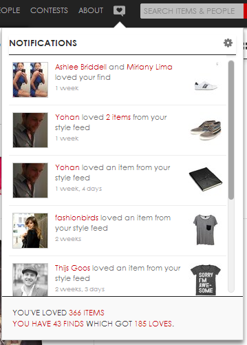
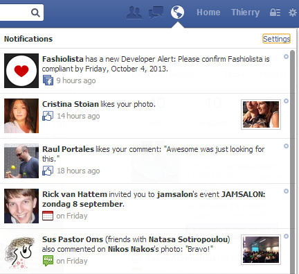

Tutorial: building a notification feed
======================================

.. note::

    We are still improving this tutorial. In its current state it might be a bit hard to follow.
    

What is a notification system?
------------------------------

Building a scalable notification system is almost entirely identical to building an activity feed.
From the user's perspective the functionality is pretty different.
A notification system commonly shows activity related to your account. 
Whereas an activity stream shows activity by the people you follow.
Examples of Fashiolista's notification system and Facebook's system are shown below.
Fashiolista's system is running on Stream Framework.

It looks very different from an activity stream, but the technical implementation is almost identical.
Only the Feed manager class is different since the notification system has no fanouts.

.. note::

    Remember, Fanout is the process which pushes a little bit of data to all of your
    followers in many small and asynchronous tasks.
    

Tutorial
--------

For this tutorial we'll show you how to customize and setup your own notification system.

**Step 1 - Subclass NotificationFeed**

As a first step we'll subclass NotificationFeed and customize the storage location and the aggregator.

::

    from stream_framework.feeds.aggregated_feed.notification_feed import RedisNotificationFeed
    
    class MyNotificationFeed(RedisNotificationFeed):
        # : they key format determines where the data gets stored
        key_format = 'feed:notification:%(user_id)s'
        
        # : the aggregator controls how the activities get aggregated
        aggregator_class = MyAggregator
        

**Step 2 - Subclass the aggregator**

Secondly we want to customize how activities get grouped together. Most notification systems need to aggregate activities.
In this case we'll aggregate on verb and date. So the aggregations will show something like (thierry, peter and two other people liked your photo).

::

    class MyAggregator(BaseAggregator):
        '''
        Aggregates based on the same verb and same time period
        '''
        def get_group(self, activity):
            '''
            Returns a group based on the day and verb
            '''
            verb = activity.verb.id
            date = activity.time.date()
            group = '%s-%s' % (verb, date)
            return group

**Step 3 - Test adding data**

The aggregated feed uses the same API as the flat feed. You can simply add items by calling feed.add or feed.add_many. 
An example for inserting data is shown below:

::

    feed = MyNotificationFeed(user_id)
    activity = Activity(
        user_id, LoveVerb, object_id, influencer_id, time=created_at,
        extra_context=dict(entity_id=self.entity_id)
    ) 
    feed.add(activity)
    print feed[:5]

**Step 4 - Implement manager functionality**

To keep our code clean we'll implement a very simple manager class to abstract away the above code.

::

    class MyNotification(object):
        '''
        Abstract the access to the notification feed
        '''
        def add_love(self, love):
            feed = MyNotificationFeed(user_id)
            activity = Activity(
                love.user_id, LoveVerb, love.id, love.influencer_id,
                time=love.created_at, extra_context=dict(entity_id=self.entity_id)
            ) 
            feed.add(activity)
            
